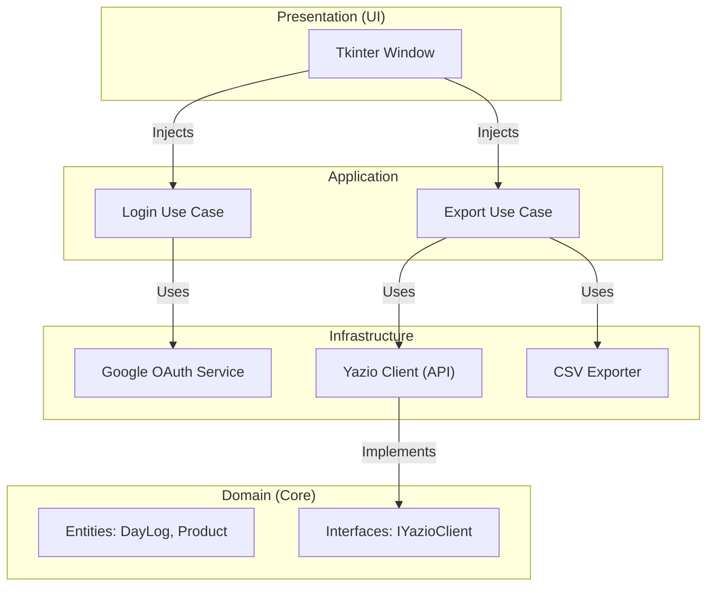

# 🥑 Yazio Consumer (Clean Architecture)


A powerful, privacy-focused desktop application to export your nutritional data from Yazio. Built with **Clean Architecture** principles, it ensures reliability, maintainability, and data accuracy.

Bypasses the limitations of standard exports by communicating directly with the Yazio API to retrieve granular data including **calories, macro-nutrients, and accurate product names**.

---

## ✨ Features

### 🔐 Dual Authentication
*   **Standard Login**: Use your Yazio email and password.
*   **Google Login** (Experimental): Seamlessly authenticates via Google OAuth (Local Server flow).
    > [!WARNING]
    > **Current Limitation**: Authenticating directly via Google Credentials is currently restricted by the Yazio API. While the app supports the OAuth flow, the final exchange for a session token may fail or be rejected by Yazio's servers. **We recommend using Standard Email/Password login for reliability.**

### ⚡ Smart Data Engine
*   **Parallel Fetching**: Uses multi-threading to download daily logs concurrently, significantly speeding up the process.
*   **Deep Hydration (Two-Pass)**:
    1.  **Scan**: Rapidly scans your meal history to identify consumed items.
    2.  **Hydrate**: Batch-fetches full product details from the API to guarantee 100% accuracy on nutrient values and product names (resolving "Unknown Product" issues).
*   **Resilience**: Automatically handles API timeouts, rate limits, and missing data chunks.

### 📊 Comprehensive Exports
Generates three detailed CSV files in your chosen output folder:
1.  **`nutrition_log.csv`**: Granular log of every single item consumed (Date, Meal Slot, Product, Grams, Calories, Macros).
2.  **`meal_summary.csv`**: Aggregated totals per meal (Breakfast, Lunch, Dinner, Snacks).
3.  **`daily_summary.csv`**: Daily totals for Calories, Protein, Fat, and Carbohydrates.

---

## 🏗️ Architecture

This project is engineered for longevity using **Clean Architecture**.



### directory structure
```text
yazio-consumer/
├── application/         # Pure Business Logic (Use Cases)
├── domain/              # core Entities & Interfaces (No dependencies)
├── infrastructure/      # External adaptations (API, File System, Auth)
├── ui/                  # Presentation Layer (Tkinter)
├── google/              # Credentials storage (Ignored by Git)
├── main.py              # Composition Root (Dependency Injection)
└── requirements.txt     # Dependencies
```

---

## 🚀 Getting Started

### Prerequisites
*   **Python 3.9** or higher.
*   *(Optional)* **Google Credentials** (`credentials.json`) if using Google Login.

### Installation

1.  **Clone the repository**:
    ```bash
    git clone https://github.com/paccolajoao/yazio-consumer.git
    cd yazio-consumer
    ```

2.  **Create a Virtual Environment**:
    ```bash
    python -m venv venv
    # Windows
### Installation (For Everyone)

**Option A: I know Git (Developers)**
1.  Clone repo: `git clone https://github.com/paccolajoao/yazio-consumer.git`
2.  Setup venv & install: `pip install -r requirements.txt`

**Option B: I just want to run it (Simpler)**
1.  **Download**: Click the green **Code** button above -> **Download ZIP**.
2.  **Unzip**: Extract the folder to your computer (e.g., Documents).
3.  **Open Terminal**:
    *   **Windows**: Open the folder, type `cmd` in the address bar, and hit Enter.
    *   **Mac/Linux**: Right-click folder -> "Open in Terminal".
4.  **Install**:
    ```bash
    pip install -r requirements.txt
    ```

---

## 🎮 Usage

1.  **Run the App**:
    In the terminal, type:
    ```bash
    python main.py
    ```
    *A window should appear.*

2.  **Authentication**:
    *   **Email/Password**: Enter your Yazio login details.
    *   **Google**: Click "Connect with Google" (See warning below).

3.  **Export Data**:
    *   Choose where to save the files (e.g., Desktop).
    *   Click **Export Data**.
    *   Wait for the "Success" message.

### 📈 How to use the Data
The app creates CSV files that are perfect for **Excel** or **Google Sheets**:
*   **drag & drop** the `.csv` files into Excel.
*   Use them to create **Pivot Tables**, **Charts**, or track specific macro trends over time.
*   **nutrition_log.csv** is best for deep pivots (filtering by Meal or Product).
*   **daily_summary.csv** is best for simple line charts of your calories.

### "Unknown Product" or Zero Calories?
This usually happens if the API returns a concise reference instead of the full object.
*   **Fix**: The app now uses a **Two-Pass** strategy. It will automatically detect missing info and fetch the specific product details from the Yazio V9 API. Just run the export again.

### Google Login not working?
*   Ensure you have a valid `google/credentials.json` file from the Google Cloud Console (Desktop App type).
*   If the app opens a browser but doesn't login, check the console logs for URL redirection issues.
*   **Note**: The app no longer auto-opens the browser on startup; you must click "Connect with Google".

---

## 🤝 Contributing

1.  Fork the project.
2.  Create your Feature Branch (`git checkout -b feature/AmazingFeature`).
3.  Commit your changes (`git commit -m 'Add some AmazingFeature'`).
4.  Push to the Branch (`git push origin feature/AmazingFeature`).
5.  Open a Pull Request.

---

**Disclaimer**: This is a third-party tool and is not affiliated with Yazio. Use responsibly.
